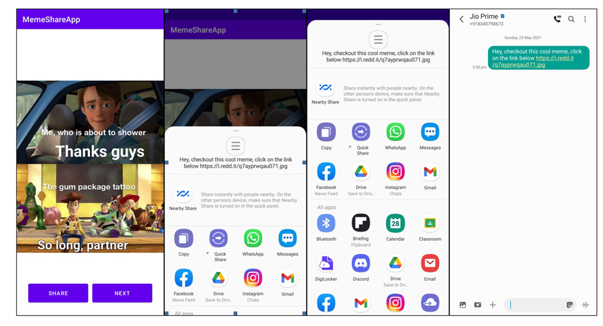

# MemeShare - Android App  

It is a fun App that gives access to millions of generated memes in just single clicks.
Unlike other apps, MemeShareApp is a free and open source.
It works on Android version(6<Marshmello> and above).

You can download this app from the download program
   

## About this App
This app gives you access to dank memes(Age restriction:12+) which was called from an open source url available on Github.
- Required Volley API to call images from the source.
- Required glide to load images and show in the screen.
- ShareButton - used to share the meme to friends in any social media apps and even in SMS and Text sharing supported apps Available on phone.
- Next button - Let's you to the next meme from image world which loads within a seconds.

## Features
MemeShare is a App which supplies laugh, joyous and lovely memories.
The android app lets you:
- Join meme family.
- Millions of generated memes in your hands.

## Screenshots

## Permissions

On Android versions prior to Android 6.0, MemeShare requires the following permissions:
- Full Network Access.
- Screen on while using the App.
- Access to all sharing apps present on the phone.

The network access permissions are made use of for downloading content. The external and internal storage permission is not used so can't be viewd offline.

## Contributing

MemeShare app is a free and open source project developed by Abhishek. Any contributions are welcome. Here are a few ways you can help:
 * [To contact me, here is my WhatsApp link](https://wa.me/+918757304764)
 * [Here is my LinkedIn profile](https://www.linkedin.com/in/abhishek-kumar-9ab838167/)
